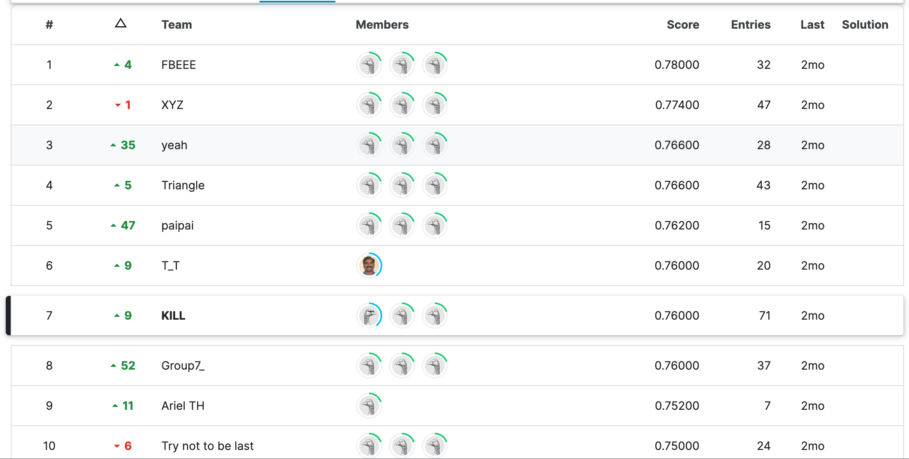
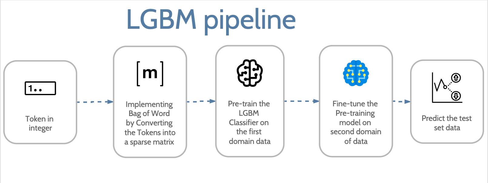

# Detecting-Machine-Generated-Text-COMP90051-2023S1-Project-1
This project is about detecting the text generated by different LLM-given prompts and created by the subject team Statistical Machine Learning from the University of Melbourne. The instance is labelled by Human and Machine, and this project utilised both traditional machine learning methods and deep learning methods to classify the instance.

# Result of the project
According to the result from the private board, LGBM could achieve 76% overall accuracy to detect LLM-generated text:

also ranked 7th in the private leaderboard, which is top 10%:

finally, scoring 11.75/12 in the Kaggle competition in Project 1:

# File Description
* `exploratory_data_analysis.ipynb`: This notebook mainly focuses on data analysis, expecting to find insight into the data.
* `lgb-comp90051.ipynb`: This notebook utilises the **LGBM classifier** to detect the LLM-generated text.
* `gru-comp90051.ipynb`: This notebook utilises the **GRU** to detect the LLM-generated text.
* `transformer-comp90051.ipynb`: This notebook utilises the **Transformer** to detect the LLM-generated text.

# Exploratory data analysis
Here is the most important found in the data:
Domain   | Machine Instances | Human Instances |
--- | --- | --- |
domain 1 | 3,500 | 122,000 | 
domain 2 | 400 | 100 | 

The project training dataset consists of human-written and machine-generated instances across two domains, each marked by significant imbalance, which means that the model should address the issue of unbalanced data. Each instance in the JSON files includes a preprocessed prompt and text, and initial exploratory data analysis has revealed distinct differences in prompt/text lengths and their standard deviations between human and machine sources. For the detail of EDA, you could visit the file `exploratory_data_analysis.ipynb`
# Model
This project uses LightGBM(LGBM), Gated recurrent units (GRUs), and Transformer in order to classify the human and LLM-generated text given by prompt. First, here is the final result for each of these models:

Model   | Private Result |
--- | --- |
LGBM | 76% |
GRU | 73% |
Transformer | 81% |

(Note: The result of GRU and Transformer are submitted after the competition is ended, which is aims to find a better way to finish this project)

Then we would delve deeper into the model part, we start from LGBM.

# LGBM Classifier
The overall pipeline to train the LGBM could be summarised by the below flowchart:

It is worth noting that we use the **goss** as our boosting type when pre-training the model, then we change our boosting type to **Dart** when we fine-tuned our model, and the detail usage of another parameter could be referred to the file `lgb-comp90051.ipynb`.

# GRU

